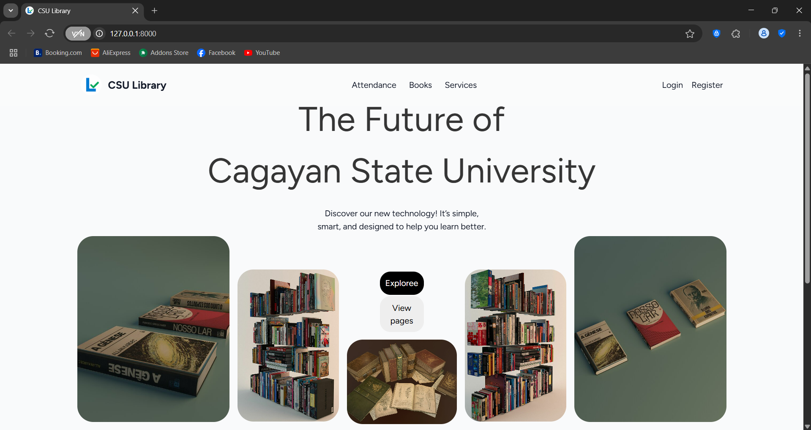

# 📚 Smart LIB — Digital Library Management & Space Optimization

<p align="center">
  
</p>

Smart LIB is a Laravel-based web application that allows students to register, log attendance, and borrow/return books using QR codes. It provides a real-time view of available books and study space in the library, making the entire library experience smarter and more efficient.

---

## 🎥 Live Demo

<p align="center">
  
</p>

---

## ✨ Features

- ✅ **Student Registration & Login**
- ✅ **QR Code Generation & Scanning**
- ✅ **Admin Panel** for managing:
  - Attendance data  
  - Book inventory and status  
  - Library space availability
- ✅ **Book Management (CRUD + Archive)**
- ✅ **Borrow/Return System via QR Code**
- ✅ **Search & Filter Books**
- ✅ **Email Notifications**:
  - QR code delivery via email  
  - Activity logs (login/logout)  
  - Overdue book reminders
- ✅ **Role-based Access**:
  - Student (User)  
  - Librarian (Admin)
- ✅ **Dashboard with Statistics**:
  - Attendance tracking  
  - Book circulation  
  - Available space metrics

---

## 🛠️ Tech Stack

- **Laravel 12**
- **PHP (Latest Version)**
- **MySQL**
- **Tailwind CSS**
- **HTML, CSS, JavaScript**

---

## ⚙️ Installation

Follow these steps to set up Smart LIB on your local machine:

```bash
# 1. Clone the repo
git clone https://github.com/reliepalor/library.git
cd library

# 2. Install PHP and JavaScript dependencies
composer install
npm install && npm run dev

# 3. Create environment file and generate app key
cp .env.example .env
php artisan key:generate

# 4. Configure your database in the .env file
# Then run migrations
php artisan migrate

# 5. Serve the application
php artisan serve
